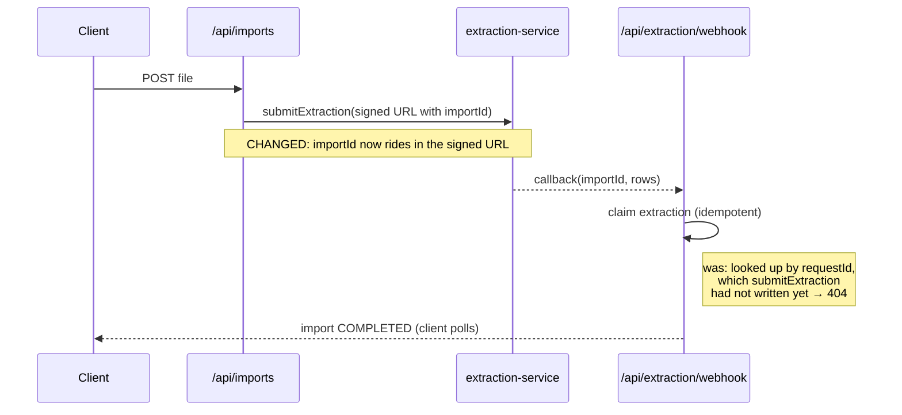
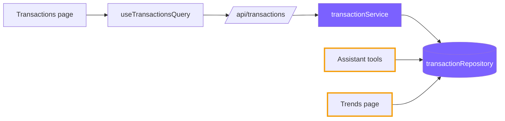

# Visualization — when the change has a shape

Read when the change is **architectural, asynchronous, or crosses component boundaries**. Skip this file for anything local.

Between Implementation and Proof of Work, add a diagram when prose would be bad at conveying blast radius. A picture answers "how much of the system does this touch, and how badly does it hurt if it is wrong" before the reviewer opens a file. GitHub renders Mermaid in PR bodies, so the diagram lives in the description itself — no image to commit, and it stays readable in both themes.

**Add one when:**

- A request crosses a service boundary or comes back asynchronously — webhooks, callbacks, SSE, cron, anything where the order of arrival is the risk.
- The change moves a responsibility between layers, or introduces a new one.
- Several components are affected and the reviewer would otherwise have to reconstruct the flow from the file list.
- Concurrency changes: something that ran once now runs N times in parallel.

**Skip it when** the change is local — a validation rule, a formatter, a component's props. A diagram of a two-file fix is the same padding as a twenty-bullet Implementation, and it counts against the length budget the same way.

### Async flows — sequence diagram

Show the ordering, and mark what this PR changed. The point is the race, not the happy path:

````markdown

````

`Note` is doing the real work — it marks the edit and states the failure it removes. A sequence diagram that only shows the new happy path tells the reviewer nothing about why the PR exists.

### Blast radius — flowchart

When the question is *what else is affected*, draw the components and highlight the touched ones:

````markdown

````

Filled = changed by this PR. Outlined = **not** changed but reading the same code, so a reviewer sees immediately that the assistant and the trends page inherit the new behaviour. That second category is the one worth drawing — it is how a "small" change turns out to be critical.

Caption every diagram with one line of prose saying what to take from it. Keep it to a dozen nodes; past that it stops being a glance.
